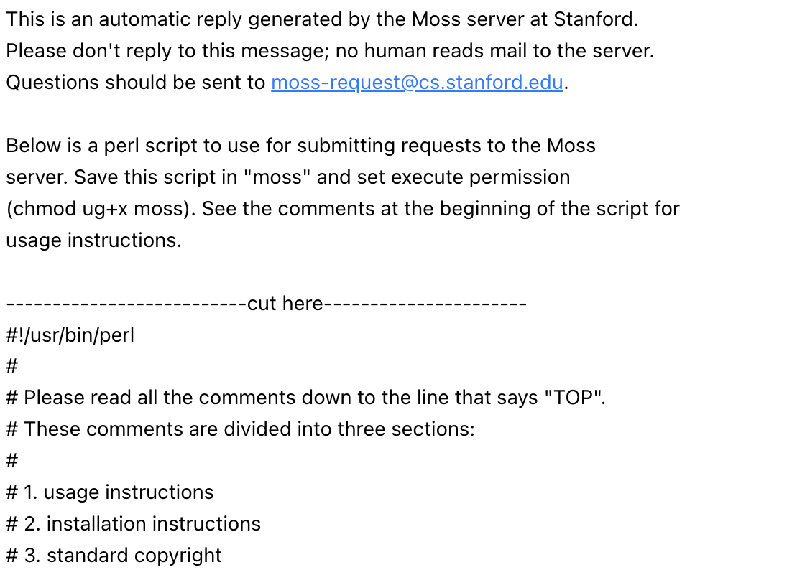

# Auto Run Moss

# Quick Start

1. Clone or download this repo (it’s up to you)
2. Install python and perl
3. Replace [moss.pl](http://moss.pl) with your own perl file
4. Change the instruction.txt file
5. Copy and paste two documents to be checked
6. Run the [run.py](http://run.py) code
7. Get result instantly

# FAQ

## How do I change [moss.pl](http://moss.pl) file?

Email moss@moss.stanford.edu with message exactly same format:

```
registeruser
mail username@domain
```

Than you will get an auto reply email containing the scripts you need.



Copy the text below “cut here” and paste them into moss.pl.

## How do I install python?

See here [https://realpython.com/installing-python/](https://realpython.com/installing-python/)

## How do I install perl?

See here [https://www.perl.org/get.html](https://www.perl.org/get.html)

## How do I change instruction.txt?

In the file, replace your folder directory, so you would run the code more easier every time you copy and paste them into terminal.

```
This file is optional. It would be easier to change this code and run it every time you copy it.
 
 cd <your folder dir>
 python3 run.py
```